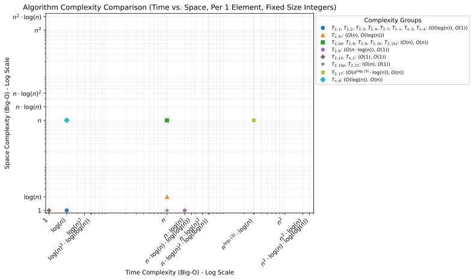
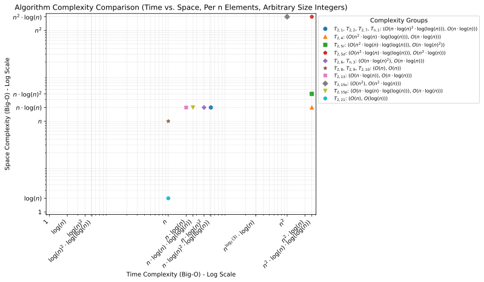

Thue-Morse Paper Draft
======================

In this repo, I keep all notes and files related to my research on extending the Thue-Morse sequence to n-ary
rigorously. It is structured as:

Repository Structure
~~~~~~~~~~~~~~~~~~~~

.. code-block:: text

  /
  ├─LICENSE                   # License file
  ├─README.rst                # Project readme
  ├─update_from_overleaf.bat  # Script to update the repository from Overleaf ZIP and PDF
  ├─update_from_overleaf.sh
  ├─rendered.pdf              # Compiled PDF output of the Overleaf project
  ├─src/                      # Directory containing the LaTeX source files
  │ ├─main.tex                  # Main LaTeX file (the entry point for compiling)
  │ ├─macros.tex                # LaTeX file that contains utility functions
  │ ├─references.bib            # Bibliography file (uses BibTeX for citations)
  │ ├─figures/                  # Directory for image files used
  │ │ ├─benchmark/                # Directory containing benchmark histograms
  │ │ └─complexity/               # Directory containing complexity scatterplots
  │ └─notes/                    # Directory for notes used in writing the paper
  └─dev/                      # Directory with associated code
    ├─__init__.py               # Utilities that let you collect different definitions
    ├─args.py                   # A utility file that deals with command line argument parsing
    ├─comparisons.py            # A checkpointing comparison tool for proving equality up to n entries
    ├─from_file.py              # A tool that lets you print out a binary file
    ├─make_plots.py             # A tool that lets you produce the complexity plots in the paper
    ├─test_seq.py               # A test file that allows you to check sequence equality
    ├─p2/                       # Code representation of definitions in base 2
    │ ├─__init__.py               # Empty file that allows this folder to be used as a module
    │ └─d[0-9][0-9].py            # The file for def. [0-9][0-9] of the Thue-Morse Seq. for 2 players
    ├─pn                        # Code representation of definitions in base n
    │ ├─__init__.py
    │ └─d[0-9][0-9].py            # The file for def. [0-9][0-9] of the Thue-Morse Seq. for n players
    └─compat/                   # Where possible, replace functionality from missing libraries
      ├─__init__.py
      ├─bitarray.py               # Overloads bytearray, so it uses *only* 8x more space, not >64x
      ├─fluidpythran.py           # Instead of Just-In-Time compiling, use the original function
      ├─gmpy2.py                  # Replace with int, so we're only slightly slower at large values
      ├─int.py                    # On older python versions, implement int.bit_count()
      ├─itertools.py              # On older python versions, implement batched()
      ├─numba.py                  # Replace @jit with @boost from fluidpythran if possible, or nothing
      └─z3.py                     # Detects if installed and replaces Int() if needed

Code Structure
--------------

In each file, there are two representations of each definition. The first is always formatted as
``p{2,n}_d[0-9][0-9]``. It will always take in an (optional) argument that represents the base of the generated
sequence. If it is a `p2` function, this argument will be ignored. The function will then return a
``Generator[int, None, None]`` that produces the sequence.

The second representation is always named ``to_z3()``. It takes in a single argument that is either an integer or a
Z3Py ``IntSort``, representing the base of the generated sequence. As above, if it is a ``p2`` file, this argument is
ignored. It will always return the Z3Py function representation of this definition, allowing for easy comparisons in
the test suite. Artifacts generated from this will be stored in the ``prover/`` directory.

Note that some implementations are *not* infinite generators. This is due to how sympy manages precision. The same
formula in sympy will accumulate error terms that it will not in Mathematica, where those definitions are primarily
tested.

Required Dependencies
---------------------

The following are required for some implementations. In the case of symengine / sympy this is because it is too
difficult to implement its features without other libraries. For numpy, while it isn't strictly necessary it does
significantly speed up vector operations

- numpy
- symengine / sympy

Optional Dependencies
---------------------

- bitarray (for more memory efficient arrays)
- fluidpythran (just-in-time compilation of general functions)
- numba (just-in-time compilation of math functions)
- gmpy2 (more efficient arbitrary-precision integers)
- z3-solver (formal verification of equality, where possible)
- pytest-benchmark (profiling code)
- pytest-flake8 (style)
- pytest-isort (style)
- pytest-mypy (typing)
- pytest-timeout (so long tests don't hang)
- pytest-xdist (run tests in parallel)

Usage
~~~~~

To generate each definition of the Thue-Morse Sequence and its extensions, call:

.. code-block::

  python -m dev.p{2,n}.d[0-9][0-9] <items to generate> [<number of players, if n players>]

Additionally, you can dump it to a binary file as follows:

.. code-block::

  python -m dev.p{2,n}.d[0-9][0-9] [-q] <items to generate> [<number of players>] --to-file="filename"

Note that the output is NOT human readable, and is compacting to as small a file as easily possible. This means that
each entry is ``base.bit_length()`` long, with some optional padding at the end. To read from the file, call:

.. code-block::

  python -m dev.from_file --from-file="filename"

This should give identical output to running the command that generated it without the ``--to-file`` argument. Other
than some bytes at the header, running for any definition with the same number of players and entries should produce
identical files. The current storage format supports up to ``2^64`` entries with up to 65537 players, which will take
about ``2^64 * log2(p) / 8 + 12`` bytes, for a maximum of ~34 EiB = ~36,507,222,016 GiB. This, of course, will likely
never be reached.

If you end the file name in ``.bz``, ``.gz``, or ``.lz``, the program will automatically apply compression to the file
both on read and write.

To run the update script, provide the zip file and the PDF file as arguments:

.. code-block:: bash

  ./update_overleaf_repo.sh project.zip output.pdf ["commit message"]

In a Windows environment, it runs similarly, though you need to use the batch file version:

.. code-block:: bat

  ./update_overleaf_repo.bat project.zip output.pdf ["commit message"]

Square brackets indicate an optional argument. If a commit message is not provided, git will prompt you for one.

Performance
~~~~~~~~~~~

Up to Seconds
-------------

Up to Milliseconds
------------------

Up to Microseconds
------------------

Complexity Analysis
~~~~~~~~~~~~~~~~~~~

Fixed Size Integers, One Element
--------------------------------

Fixed Size Integers, n Elements
-------------------------------

Arbitrary Size Integers, One Element
------------------------------------

Arbitrary Size Integers, n Elements
-----------------------------------

